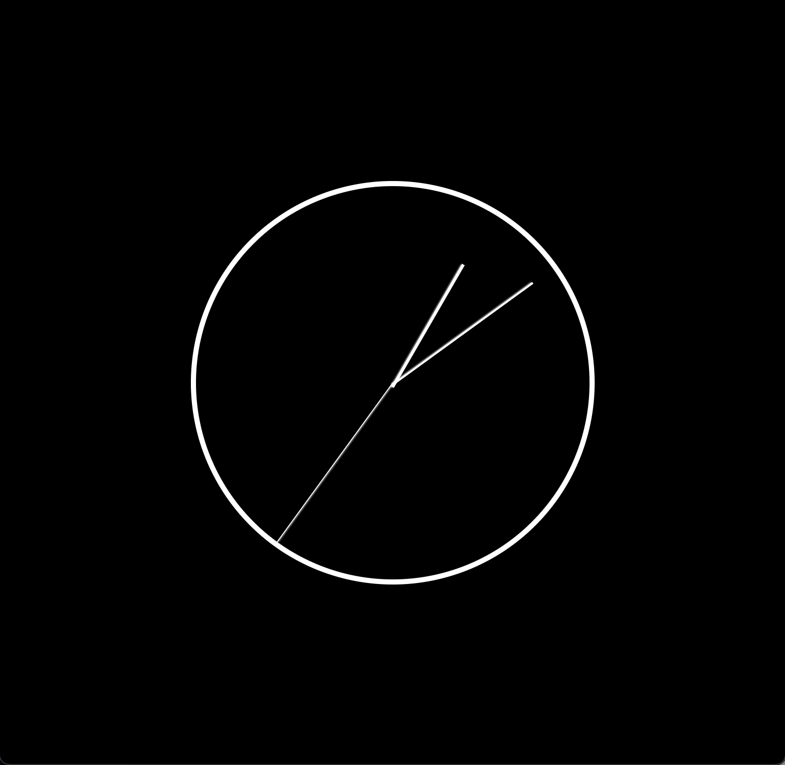

# **Analog Clock**

## Reloj digital hecho unicamente con html, css y javascript

- Se utilizan estilos ligeramente distintos en las manecillas para distinguir segundos, minutos y horas
    - La manecilla más delgada y larga se usa para representar los segundos
    - La manecilla intermedia en largo y ancho se utiliza para representar los minutos y
    - La manecilla más ancha y más corta se usa para representar las horas
- Utiliza un formato de 12 horas 
- La animación de las manecillas fluye completamente y no tiene saltos inesperados (e.g. al llegar a 60 segundos no se regresa la animación)

Puedes ver el resultado [aqui](https://raymundosantorski.github.io/analogclock/).

